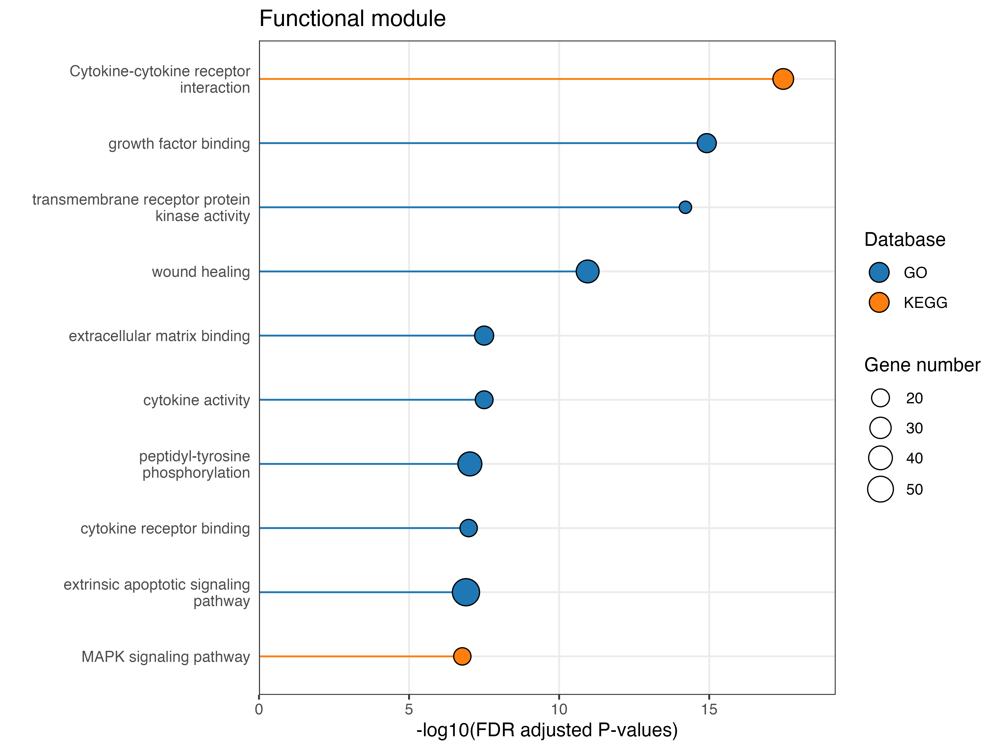
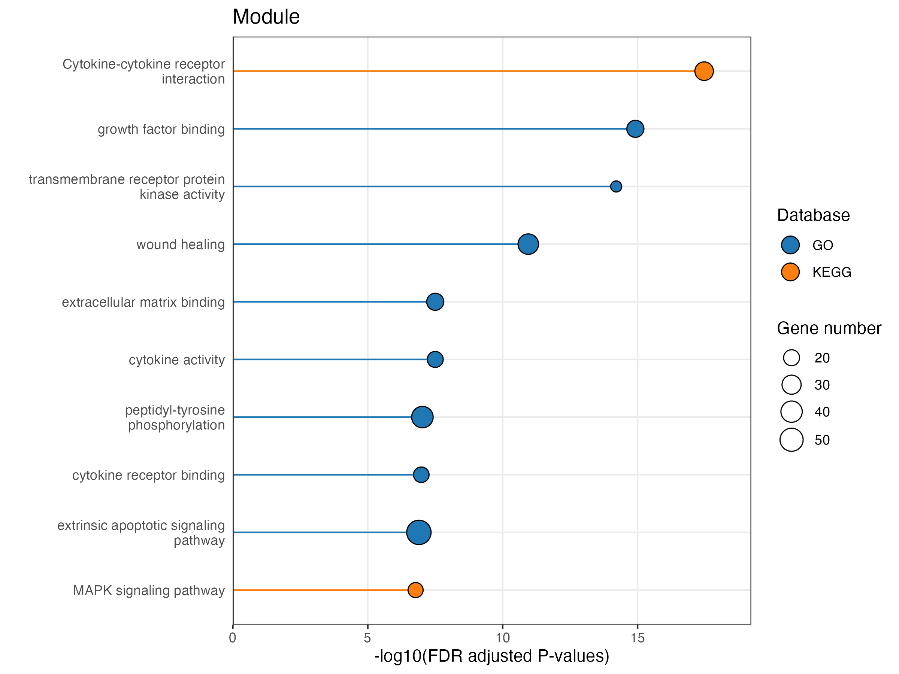
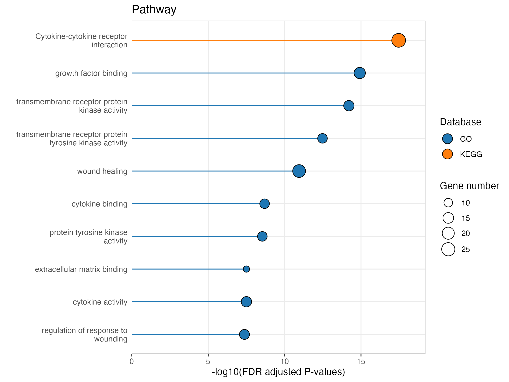
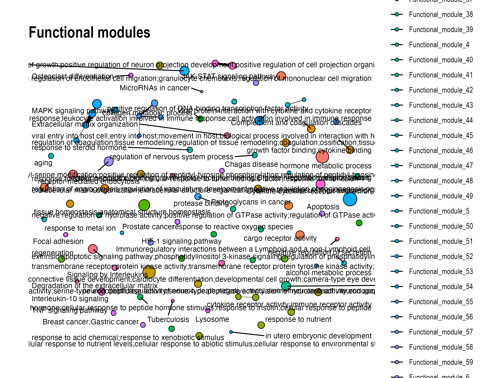
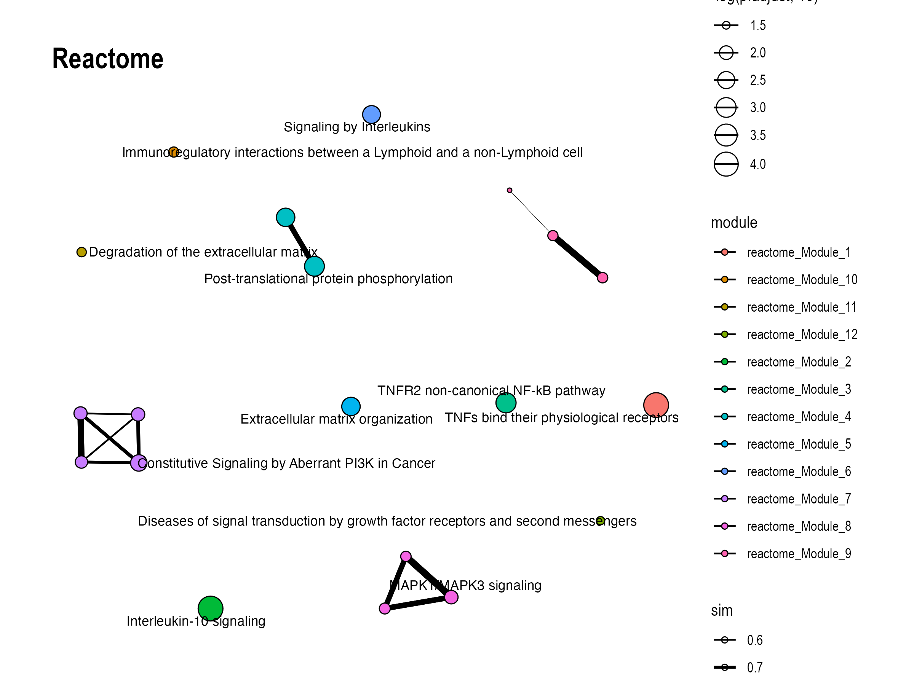
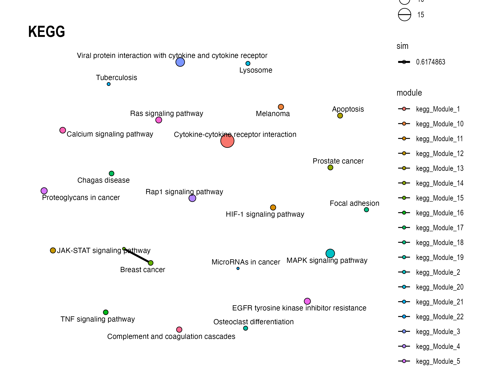

---
output:
  pdf_document: default
  html_document: default
  word_document: default
---

```{r setup, include=FALSE}
knitr::opts_chunk$set(echo = TRUE,
                      comment = "#>")
```


<h1>**Module Annotation for Pathway Enrichment Result Analysis**</h1>
<h3>[mapa](https://jaspershen.github.io/mapa/) by [The Shen lab](https://www.shen-lab.org/)</h3>
<h3>`r format(Sys.Date())`</h3>

---

# **<font color = "lightseagreen">Introduction</font>**

<h4> <p style="line-height:1.5em;">**mapa (version 0.01)**: Created in 2021 by [The Shen lab](https://www.shen-lab.org/)</p> </h4>

---

# **<font color = "lightseagreen">Parameters</font>**

```{r, echo=FALSE, message=FALSE, warning=FALSE, message=FALSE}
library(knitr)
load("parameters.rda")
kable(parameters, format = "markdown")
```

---

# **<font color = "lightseagreen">Object information</font>**

```{r, echo=FALSE, message=FALSE, warning=FALSE, message=FALSE}
load("object.rda")
object
```

# **<font color = "lightseagreen">Bar plot shows the top 10 modules/pathways</font>**





**Figure 1: Barplot of the enriched pathways/modules.**

# **<font color = "lightseagreen">Module network</font>**






**Figure 2: Module networks of the enriched pathways/modules.**


# **<font color = "lightseagreen">Interpretation of functional modules</font>**

```{r, echo=FALSE, message=FALSE, warning=FALSE, message=FALSE}
# knitr::asis_output(paste0("> There are ", length(params$text_data$functions), " functional modules in total."))
```

```{r, echo=FALSE, message=FALSE, warning=FALSE, message=FALSE}
knitr::asis_output(params$text_data)
```

